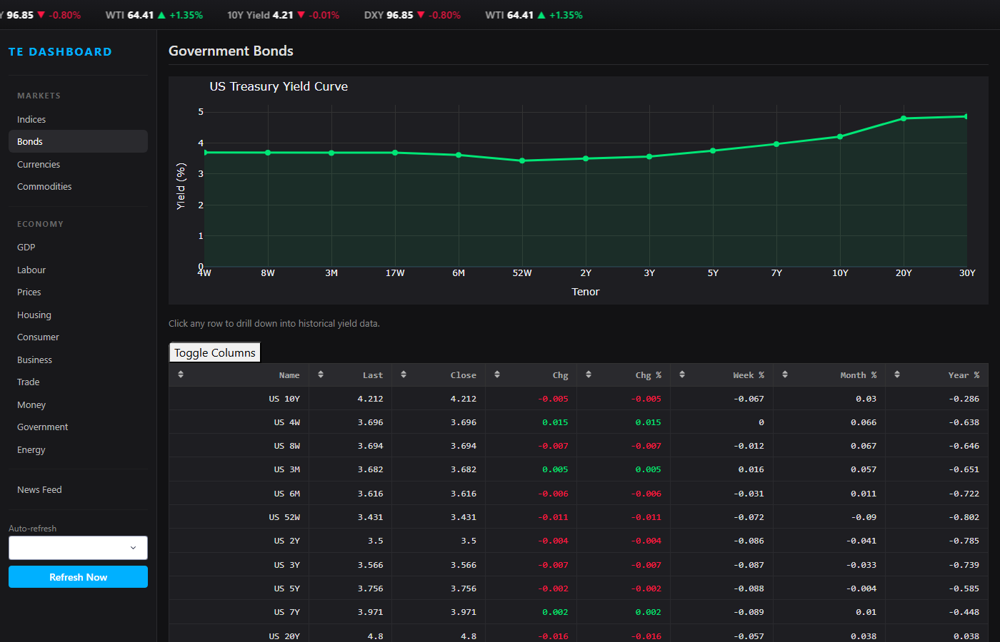
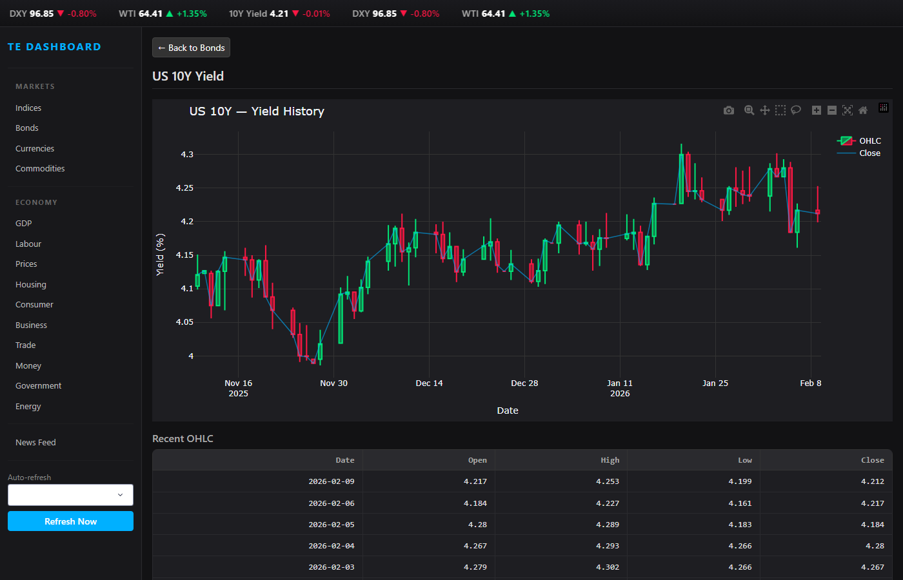
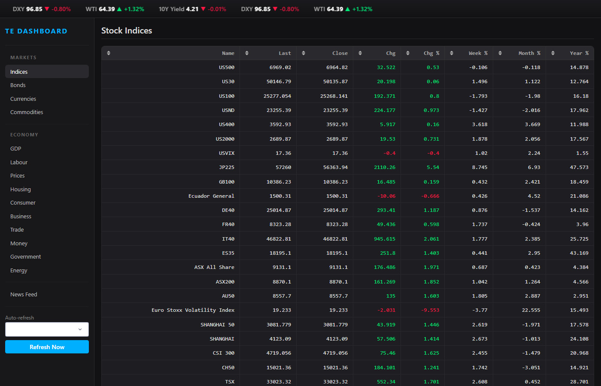
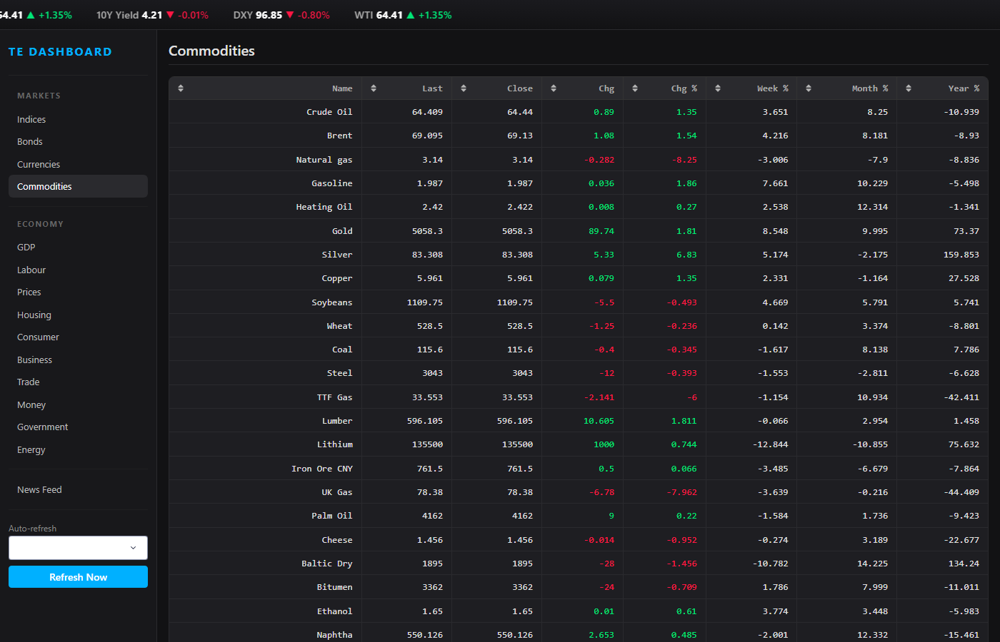
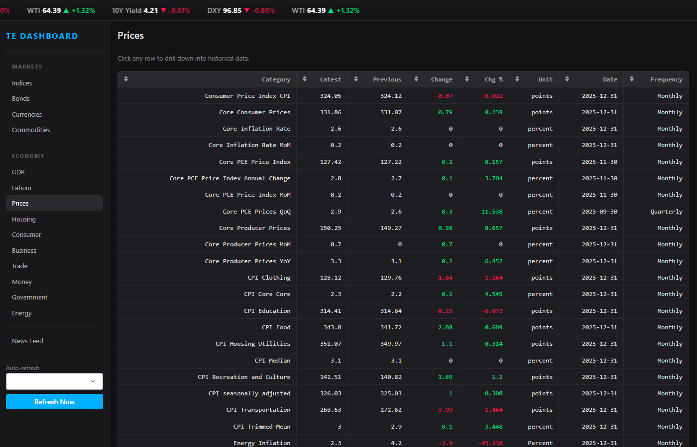
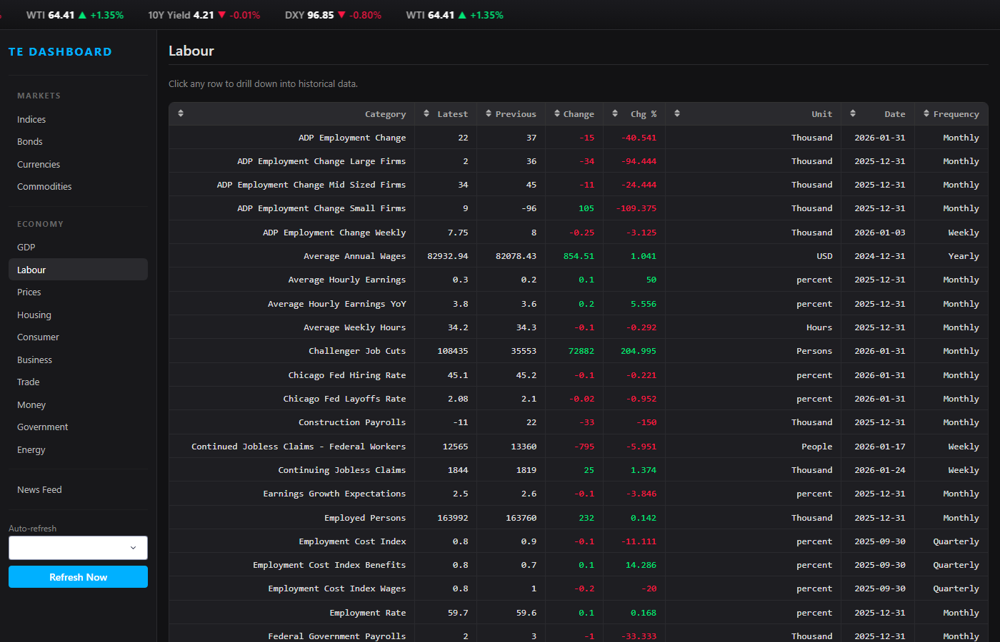
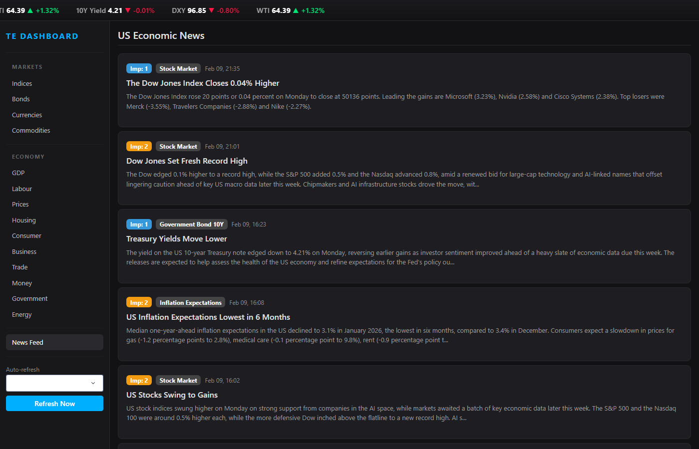

# Trading Economics Dashboard

A dynamic, dark-themed US economic dashboard powered by the [Trading Economics API](https://tradingeconomics.com/), built with Python Dash and Plotly.

  

## Screenshots

### Bonds — Yield Curve + Table


### Bond Drill-Down — US 10Y Candlestick Chart


### Stock Indices


### Commodities


### Economy — Prices & Inflation


### Economy — Labour Market


### News Feed


## Features

### Live Ticker Bar
Scrolling real-time prices across the top: S&P 500, Dow, Nasdaq, VIX, 10Y Yield, DXY, WTI. Green/red color-coded with auto-refresh every 60 seconds.

### Markets
- **Indices** — Global stock indices with daily, weekly, monthly, and yearly change %
- **Bonds** — Interactive US Treasury yield curve chart + clickable table with candlestick drill-down for any tenor
- **Currencies** — Major FX pairs with full change breakdowns
- **Commodities** — Energy, metals, agriculture with sortable columns

### Economy
Click any sidebar category to view all US indicators in that group:

| Category | Examples |
|----------|----------|
| GDP | GDP Growth Rate, GDP from Services, GDP per Capita |
| Labour | Non Farm Payrolls, Unemployment Rate, ADP Employment |
| Prices | CPI, Core PCE, Producer Prices, Inflation Rate |
| Housing | Building Permits, Mortgage Rates, Home Sales |
| Consumer | Consumer Confidence, Retail Sales, Personal Spending |
| Business | ISM Manufacturing, Durable Goods, Factory Orders |
| Trade | Balance of Trade, Exports, Imports, Current Account |
| Money | Interest Rate, Fed Funds Rate, Money Supply |
| Government | Government Debt, Budget, Credit Rating |
| Energy | Crude Oil Rigs, Production, Stocks |

**Click any row** to drill down into a full historical chart with forecast overlays and a recent values table.

### Bond Drill-Down
Click any bond in the Bonds table to see:
- Candlestick OHLC chart of historical yield data
- Closing yield line overlay
- Paginated OHLC data table

### News Feed
Latest US economic headlines from Trading Economics with importance badges and category tags.

### Auto-Refresh
Configurable polling interval (Off / 1 min / 5 min / 15 min) with a manual "Refresh Now" button. API responses are cached (60s for markets, 15 min for indicators, 1 hour for historical) to minimize rate limit usage.

## Setup

### Prerequisites
- Python 3.10+
- A [Trading Economics](https://tradingeconomics.com/) API subscription

### Install

```bash
git clone https://github.com/GrandPi224/TEAPI.git
cd TEAPI
pip install dash dash-bootstrap-components plotly pandas requests
```

### Configure

Set your Trading Economics API key as an environment variable:

```bash
# Windows
set TE_API_KEY=your_key:your_secret

# Linux/Mac
export TE_API_KEY=your_key:your_secret
```

See `.env.example` for the expected format.

### Run

```bash
python app.py
```

Open **http://127.0.0.1:8050** in your browser.

## API Endpoints Used

| Endpoint | Purpose |
|----------|---------|
| `/country/united states` | Snapshot of all ~280 US economic indicators |
| `/historical/country/united states/indicator/{name}` | Time series for any indicator |
| `/forecast/country/united states` | Forward-looking forecasts |
| `/markets/index` | Live stock indices |
| `/markets/bond` | Government bond yields |
| `/markets/currency` | FX rates |
| `/markets/commodities` | Commodity prices |
| `/markets/historical/{symbol}` | OHLC history for market instruments |
| `/news/country/united states` | Economic news feed |

## Project Structure

```
te_dashboard/
  app.py              # Main Dash app — layout, callbacks, entry point
  te_api.py           # Trading Economics API wrapper with caching
  assets/
    custom.css        # Dark theme, ticker animation, table styling
  screenshots/        # Dashboard screenshots for README
  .env.example        # Environment variable template
  .gitignore
  README.md
```

## Tech Stack

- **[Dash](https://dash.plotly.com/)** — Python web framework for interactive dashboards
- **[Dash Bootstrap Components](https://dash-bootstrap-components.opensource.faculty.ai/)** — DARKLY theme UI components
- **[Plotly](https://plotly.com/python/)** — Interactive charts (candlestick, line, scatter)
- **[pandas](https://pandas.pydata.org/)** — Data manipulation
- **[requests](https://docs.python-requests.org/)** — HTTP client for API calls
